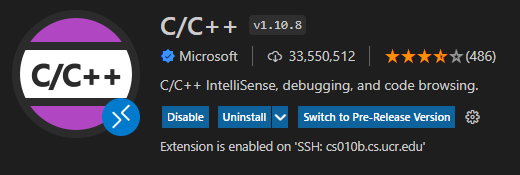
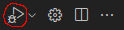
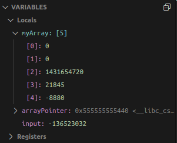
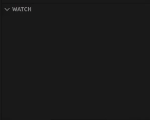
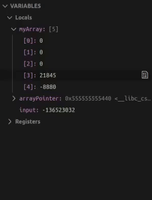
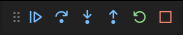
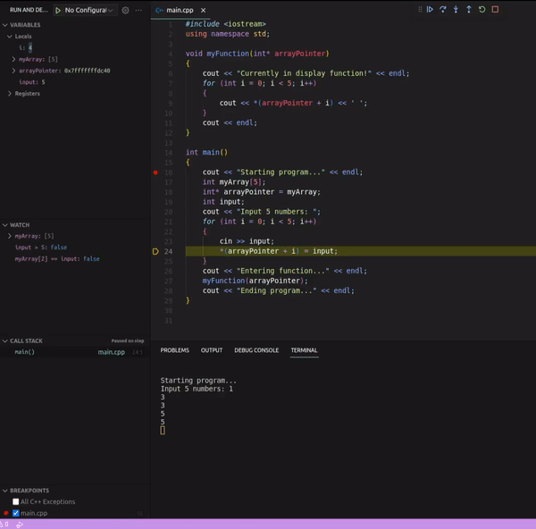
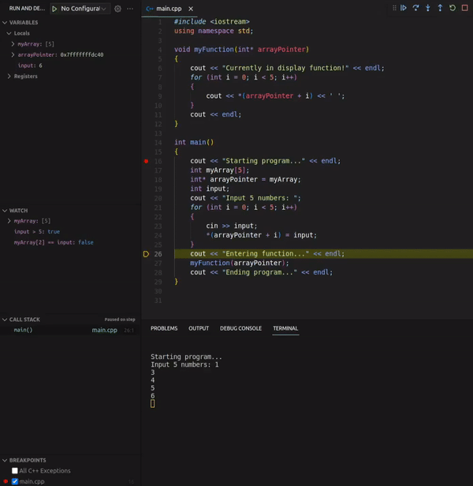
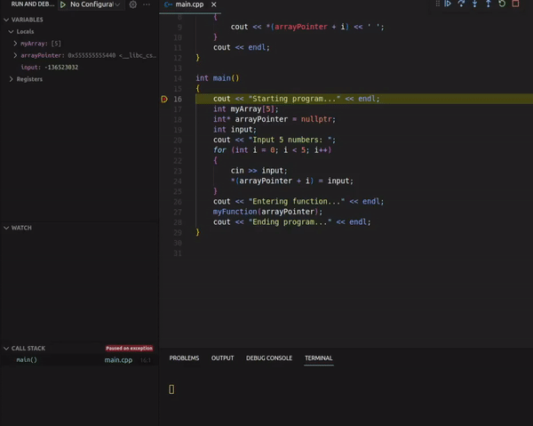
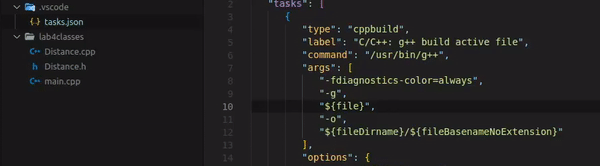

# Debugging Tutorial Part 1

> Authors: Victor Hill and Joshua Candelaria (special thanks to Professor Neftali Watkinson and Professor Kris Miller)

Now that you know about pointers and how problematic they can be, we will be going over a useful tool that will help you catch your mistakes. Today, you will learn:

* What a debugger is
* Basic use of a graphical interface debugger using breakpoints and watching variables
* How to debug across multiple files
* Common mistakes with pointers

## What is a Debugger?

A debugger gives you a closer look at your program, allowing you to look at exactly what it is doing while it executes line by line. You can see variable values, memory locations and what is in all your data structures (arrays, vectors). It is a useful tool to diagnose what is happening in your program if the output is not what is expected, or if it crashes entirely. In this tutorial, we will be using the built in debugger in VSCode.

## Setup

All you need to use the debugger built into VSCode is to install the C++ extension from the VSCode extension marketplace. If you don't have the extension installed, then go to the extension marketplace and install this extension:

<p align="center">
    
</p>

## Using the Debugger

We will start with a simple example to introduce the features of the debugger. Create a new file called `debugexample.cpp`, and paste the following contents in:

```cpp
#include <iostream>
using namespace std;

void myFunction(int* arrayPointer)
{
    cout << "Currently in display function!" << endl;
    for (int i = 0; i < 5; i++)
    {
        cout << *(arrayPointer + i) << ' ';
    }
    cout << endl;
}

int main()
{
    cout << "Starting program..." << endl;
    int myArray[5];
    int* arrayPointer = myArray;
    int input;
    cout << "Input 5 numbers: ";
    for (int i = 0; i < 5; i++)
    {
        cin >> input; 
        *(arrayPointer + i) = input;
    }
    cout << "Entering function..." << endl;
    myFunction(arrayPointer);
    cout << "Ending program..." << endl;
}
```

This program takes in 5 integer inputs from the user, and stores them into an array and outputs them.

### Setting Breakpoints

A breakpoint in a debugger is a point where we tell the program to pause, so we can look at what exactly is going on at that point of the program. In order to set a breakpoint, hover your cursor next to the line numbers. You should notice a small translucent red dot pop up; clicking it will set a breakpoint at that line of code.

<p align="center">
   
</p>

Set a break point at line 16 (which is `cout << "Starting program..." << endl;`). This will pause the program at line 16 once you start the debugger. In order to start your debugger, you have to set at least one break point, otherwise it will just run through the code normally. We set it at the start of the main function in order to step through our code line by line.

You can set breakpoints in your code wherever you need to, and you can set as many as you want. The program will stop at each breakpoint you set, so you can observe the state of the program at each breakpoint.

### Watching Variables/Arrays

Now, in the top right corner, there should be a button that is labeled "Debug C/C++ File". Click it, and you should be prompted to select a debug configuration. Select one that says `g++` (if there are multiple ones, just pick the first `g++` that you see).

<p align="center"> 
     
</p>

Once your debugger starts, your interface will change. Let's look at the side bar first before we step through the program. In the first window in the top left we are able to see the variables, and all their values! The values of `myArray` can be seen with a dropdown menu by clicking on it. The values should look like junk right now, but that's only because we only declared the variables without assigning anything to them. You can keep an eye on the value of your variables as your progress through your code here.

<p align="center">
    
</p>

However, it is rare that you would care about *all* of your variables at the same time. Sometimes, you're only concerned with a few of them. That is what the `Watch` tab is for. We can add expressions we want to watch for, and it will alert us whenever they become true or false. You can add a variable and the debugger will tell you whenever it changes, or you can put in a boolean expression and it will tell you whenever it changes from true to false or vice versa. Here's an example of some types of expressions you can input into the watchpoint list:

<p align="center">
    
</p>

Add some expressions into yours, and watch how they change once you input values into the array.

Something else you can do with this tool is change the value of your variables in the middle of your program! All you have to do is right click the variable, and select "Set Value" (or double click it). This is useful if you want to examine some sort of specific behavior at some value.

<p align="center">
    
</p>

### Step In vs Step Over, and Step Out

We control the debugger using this bar right here:

<p align="center">
    
</p>

This bar is what you will use to control your debugger. The first button is "Continue", and pressing this button will run your program up until the next breakpoint. 

The next two buttons, "Step Over" and "Step Into" both execute the next line of code. However, if the next line of code is a *function*, then "Step Over" tells the debugger to literally *step over* the function, running the entire function, then go to the line after the function call. If you press "Step Into" instead, then the debugger *steps into* the function, allowing you to run the function line by line. You would use "Step Over" if you want to skip a function (maybe you know it already works, or you want to go further ahead into your code), whereas you would use "Step Into" if you want to run the function line by line. 

If you accidentally step into a function, or you want to "fast forward" to the end of a function, then pressing "Step Out" tells the debugger to *step out* of the function, by running all the lines of code up until the end of the function, pausing at the next line of code after the function call.

> Note: If you "step in" and the debugger ends up opening another file, that means you have stepped into a function defined by the C++ standard library, like `cin` or `cout`. There's no need to waste time in there, so if you end up stepping into functions from an imported library like `iostream`, step out so you don't waste any time.

The next two buttons, "Restart" and "Stop" are self explanatory.

Here is an example of "Step Over":

<p align="center">
    
</p>

...and here's an example of "stepping into and out":

<p align="center">
    
</p>

Feel free to step all over the program, and play around a bit with the debugger. Since this program compiles, works properly, and terminates successfully, you can use this program to get familiar with the debugger interface. The next section will go over how we use the debugger to find and diagnose crashes.

> Note: When you get to the line where you are prompted for input, which is the line `cin >> input;`, the tab on the bottom should switch to the Terminal. However, if it stays on the Output tab, then switch to the Terminal manually by clicking the Terminal tab (shown in the gif above) and you should be able to see the program's output/prompt for input.

### Finding Crashes

In order to find a crash in our program, lets change our `main.cpp` file so that it doesn't work. Change the line `int* arrayPointer = myArray;` to `int* arrayPointer = nullptr;` (should be line 18). Compile and run the program just to make sure you have a segmentation fault (specifically, at the first input). 

Now, run your debugger through the program by repeatedly pressing the step in button, giving input to the program when prompted. It should terminate at the line where the segmentation fault happened. 

> Note: You can also use the continue button, which will take you through the program and still take you to the line where the error occured.

<p align="center">
    
</p>

We can see that our program terminated at line 24, which is `*(arrayPointer + i) = input;`. From this line, we see that it is an assignment operation to a dereferenced integer pointer. Since segementation faults deal with memory, then our pointer must be the problematic variable here. We can check it in the variable list, and see it has the value `0x00`, which means it corresponds to a null pointer. Therefore, that is what is causing the crash.

Since the debugger told us exactly which line the crash happened, we were able to deduce what the error was based on the error message and the line itself. However, we still had to have some background knowledge - the debugger doesn't do *all* of the work for us!

### Debugging with Multiple Files

You may have noticed that if you attempt to run the debugger on a file with mulitple linked source files, you get an error. The process for debugging with multiple linked source files requires some setup. By default, VSCode assumes that you are debugging only one file. In order to make it so the debugger recognizes that you have linked source files, we need to make a slight change. Notice that when you started the debugger, a new directory called `.vscode` was created within your directory. Open it, and you should see a file called `tasks.json`. This file is used by the debugger to pass in arguments to the debugger so you don't have to. We are interested in the block called `args`. You should see that there is a list of arguments in that block. They are telling the debugger where to look for the source files. The argument `"${file}"` represents the file you run the debugger on, but only that file. In order for the debugger to recognize the other files you are using, you must change the arguments slightly. Replace that argument `"${file}"` with the paths of all the files you wish to use, and your debugger will be able to jump across them as needed.

<p align="center">
    
</p>

> Note: If you have a `.vscode` folder that doesn't have `tasks.json`, but has other files in it like `launch.json`, simply delete the `.vscode` folder and run the debugger again.

Let's break down the path: `../lab4classes/Distance.cpp`.

`..` refers to the previous directory. This is because the `tasks.json` file we are editing is in the `.vscode` directory, so we must go to the directory it is in to navigate to where the directory `lab4classes` is in. Then, we navigate to our source files that are in the `lab4classes` directory. The idea is the same for `main.cpp` as well.

## Examples of Common Errors using Pointers and Linked Lists

While it is a good skill to know how to use a debugger, it is still just a tool like a fancy text editor or a syntax highlighter. Technically, all you get out of a debugger is a deeper look at your program as you step through it line by line. It should not be used as a crutch, as it doesn't tell you anything other than the current variable values, memory locations, and where your program terminates. **To get legitimate value out of a debugger, you need to be able to trace your code and understand where the errors come from.** A debugger may be able to tell you the exact line your program came to a halt due to a segmentation fault, but that information doesn't mean much if you don't understand why your program would crash there. Being able to recognize patterns and common errors will allow you to get better use out of a debugger.

[Here](./main.cpp) is a small list of common errors made with pointers that your IDE won't bail you out of. While these errors are written in a way that it is obvious to spot what is wrong with each example, it is important to recognize that they exist and can be helpful in diagnosing what may be going wrong in your programs. The errors shown in that example may seem obvious now, but that is only because each error is presented in isolation; it is much harder to spot the exact error when looking at a file that is hundreds of lines long and these errors could potentially span across functions/scopes/files. Recognizing (no need to memorize, you'll run into them yourself eventually) the patterns here will help you find them down the line, and could save you countless hours of debugging.

> Note: It is important to understand the difference between undefined behavior and segmentation faults/other runtime errors. Undefined behavior doesn't necessarily mean your program crashes; it means it behaves in a way that is completely unexpected/unpredictable and potentially changes every time you run the program. This type of random behavior makes it much harder to identify the root of the issue.
