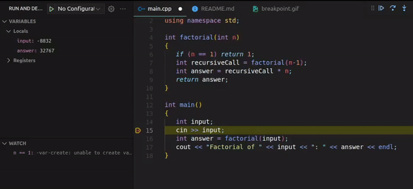
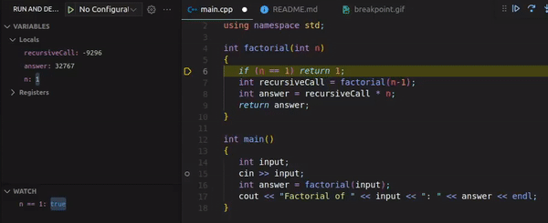
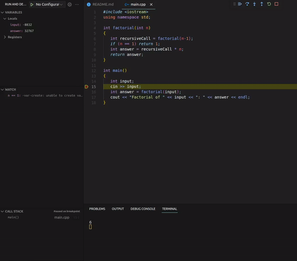

# Debugging Tutorial: Recursion

> Authors: Victor Hill and Joshua Candelaria (special thanks to Professor Neftali Watkinson and Professor Kris Miller)

You have already learned how to use a debugger to help you diagnose issues found in programs that use pointers. Now, you will learn about the tools used to debug recursive functions. Today, you will learn:

* What the call stack is, and visual representations of it.
* How to use a debugger with a recursive function.

## Call Stack

A call stack, sometimes called the run-time stack or program stack, is a data structure that your programs use in order to keep track of function calls so the program knows where to return to after a function returns/terminates. For example, let's say you you had a function named `one()`, and in that function, you call a function called `two()`, the program would push `one()` onto the call stack, start executing what is in the function `one()`, then in that function, you call `two()` and push `two()` on the call stack. Then, the program will be in the function `two()`, do everything that is in that function, then return back to `one()` because `two()` was called in `one()`. The *last function called* will be the *first function out* of the call stack. Here is a visual example of the call stack.

<p align="center">
    
</p>

In order to see the call stack in your debugger (bottom left corner once you are running the debugger), copy-paste this example:

```cpp
#include <iostream>
using namespace std;

void _do(); void re(); void mi(); void fa(); void so(); void la(); void ti();

void _do()
{
    re();
    cout << "do" << endl;
}

void re()
{
    mi();
    cout << "re" << endl;
}

void mi()
{
    fa();
    cout << "mi" << endl;
}

void fa()
{
    so();
    cout << "fa" << endl;
}

void so()
{
    la();
    cout << "so" << endl;
}

void la()
{
    ti();
    cout << "la" << endl;
}

void ti()
{
    cout << "ti" << endl;
}

int main()
{
    _do();
}
```
*Before you do anything: can you guess what the output will be?*

Set your breakpoint to be the call to `_do();` in `main` and run the debugger, and keep an eye on the call stack tab in the bottom left corner. **Make sure you use "Step Into" here! Using "Step Over" will just skip the whole program, as it will step over all the functions at once.** As the functions are called, they are added to the "top" of the call stack, then once that function is done, it goes to the previous function it was called from, and this continues. This kind of visualization will make it easier to see recursion.

Even without a recursive function, it is still useful to have the call stack visualized when you have several "nested" function calls, so you can tell where you will return to once each function call is finished. You can click each function call on the call stack to see exactly where the function was called, and with what parameters/variable values. It will be especially useful in programs that are larger in scope, as you can tell if a program is working as expected quickly (or what is going wrong) by examining the call stack.

## Recursion 

As you have learned in lecture, a recursive function is a function that breaks a problem into smaller sub-problems in order to solve the original problem. However, since we usually think iteratively, it is hard to grasp the concept of recursion at first. In order to help visualize recursion, it is helpful to have a look at the call stack, and of each input at each recursive step.

Create a new `example` directory, and inside, create a `factorial.cpp` file with the following contents copy pasted in:

```cpp
#include <iostream>
using namespace std;

int factorial(int n)
{
   if (n == 1) return 1;
   int recursiveCall = factorial(n-1);
   int answer = recursiveCall * n;
   return answer;
}

int main()
{
   int input;
   cin >> input;
   int answer = factorial(input);
   cout << "Factorial of " << input << ": " << answer << endl;
}
```

Place your breakpoint at line 15, which is `cin >> input;`. Run your debugger on this program, and input a number greater than 5 so we can really see the recursive depth of the program. 

Keep stepping in and **stop** when you see `n == 1`, in other words, when we get down to the base case. You could set a watch expression to do this. This will help us see how recursion works. Notice that as you keep stepping in, `n` is the only variable that isn't a junk value. This is because recursive algorithms *divide* the problem until it cannot get any smaller (base case), then *conquer* the problem by solving the base case and progressively solving the bigger subproblems until it gets back to the original problem. This is the *divide* portion, as we have gotten down to the base case of `n == 1`.

> Note: When debugging a recursive function, it is useful to set a watch expression for your base case, so you can quickly see if you reach your base case or not.

<p align="center">
    
</p>

Let's see the recursive function solve the problem. Now that we are at the base case, we can start working up to the original problem, which was whatever you input. Keep stepping in; you should notice that the variables `answer` and `recursiveCall` are being assigned the proper values. As you step through the program, keep an eye on the call stack. Notice the value of `recursiveCall` is simply being assigned the value of `answer` in the next recursive call you step into. This is because the variable `recursiveCall` is going to be assigned the returned value of the current recursive call (as seen on line 7 of the program), and we use that value to calcluate the next value. We just have to wait until the smaller subproblems get calculated first until we can evaluate the original problem.

<p align="center">
    
</p>

It may be helpful to think of recursion this way: imagine you are sitting in a dark theatre, and you want to know what row number you are sitting in, but you cannot see the row numbers. You ask the person in front of you what row number they are sitting in, because your row number will be their row number + 1. However, it is too dark for them to see as well, so they ask the person in front of them as well, and this chain keeps going. It stops when we get to row 1, since that person has nobody in front of them, so they know for a fact they are in row 1. The person in row 1 tells the person behind them that they are in row 1, so the person behind row 1 knows they are in row 2 now, and they tell the person behind them what row they are in now, up until it gets back to the original person who asked.

The chain of people asking the person in front of them what row they are in can be considered the divide portion of recursion, the person who was in row 1 can be considered the base case, and the chain of people telling each person behind them their row number can be considered the conquer portion. You can also think of each individual person who is waiting for an answer on the person in front of them as a function call on the call stack, as they are waiting for the person in front to "return" the row number.

### Finding Errors in a Recursive Function

Now, let's make our program crash. One of the most common errors with recursion is that our base case is never reached. In order to modify our program to never reach the base case, let's swap lines 6 and 7, which are the lines:

```cpp
   if (n == 1) return 1;
   int recursiveCall = factorial(n-1);
```

Once these two lines are swapped, you can compile and run it to make sure it doesn't terminate/has a runtime error. Run the debugger with the same breakpoint at `cin >> input;` using Step In repeatedly. Keep stepping in like in the previous part, but notice that the function never gets to the base case, since we swapped the base case and the recursive function call, meaning we don't even get to the check. In this example, this is an easy bug to find and fix, however, this pattern of never reaching the base case is quite common. Notice how trivial it was to spot that the base case was never being reached through the debugger. This can be a useful way to diagnose an issue that you have in a recursive function.

<p align="center">
    
</p>

## Examples of Common Errors with Recursion

Getting used to writing recursive functions is difficult, since thinking recursively is something that we don't usually do. A debugger can be useful in illustrating how a recursive function works by seeing the order in which the lines are run, and being able to trace the call stack. Since recursion is more of a technique, the way you use recursion will vary based on different problems, so there isn't really a (big) universal list of common errors since different problems have difference recursive solutions. However, recognizing these errors will help you write and debug recursive functions.

For these examples, try to trace them *by hand* first to see if you can figure out what is wrong, then use the debugger to see where the function is wrong.

### Common Error 1:

```cpp
#include <iostream>
using namespace std;

int factorial(int n)
{
   if (n == 1) return 1;
   int recursiveCall = factorial(n);
   int answer = recursiveCall * n;
   return answer;
}
```

<details>
<summary>Answer</summary>

In this example, **the base case is not being reached**. Every time we call the function ``factorial``, the input is not being decreased, so unless the input is `n == 1`, the function will never terminate. The correct implementation would be changing the line 7 to ``int recursiveCall = factorial(n-1)``. It is important to make sure that the *problem is broken down into smaller sub-problems at every recursive step/call* so the base case is reached, and the function is able to return with the correct output.

</details>

### Common Error 2:

```cpp
// n is size of myVec
int recursiveSumOfVector(vector<int> myVec, int n)
{
    if (n == 0)
    {
        return 0;
    }
    else
    {
        return recursiveSumOfVector(myVec, n-1);
    }
}
```

<details>
<summary>Answer</summary>

In this example, **the recursive results are being used incorrectly**. We are indeed reducing the size of the problem by breaking it down into smaller sub-problems, but we are not considering the results of those subproblems since we are only reducing the size. Therefore, the correct implementation would be changing the recursive call to be ``return myVec.at(n-1) + recursiveSumOfVector(myVec,n-1);``. By reducing the size of the vector and also adding the last element at each recursive call, we are building up to the solution of the original problem at each recursive call. We need to make sure that we consider the steps of each recursive call, and use them to build up to the answer of the whole problem. 

</details>

### Common Error 3:

```cpp
// Recursive implementation of the Fibonacci Sequence:
// https://en.wikipedia.org/wiki/Fibonacci_number#Definition
int fib(int n)
{
    if (n == 1)
    {
        return 1;
    }
    else
    {
        return fib(n - 1) + fib(n - 2);
    }
}
```

<details>
<summary>Answer</summary>

In this example, **the base case is incorrect, or rather, not all the base cases are covered**. Consider what happens when `fib(2)` is called. We will be returning `fib(1) + fib(0)`. When `fib(0)` is evaluated, the function will not terminate since `0` is not considered in our base case. Therefore, we need to add another base case where we consider `0`:

```cpp
if (n == 0)
{
    return 0;
}
```

Recursive functions can have many base cases. It is important that you closely examine the nature of the problem that you can try to solve recursively so that you consider every possible base case, or the smallest possible problem you can break down to, so that the function can terminate and return the proper output.

</details>