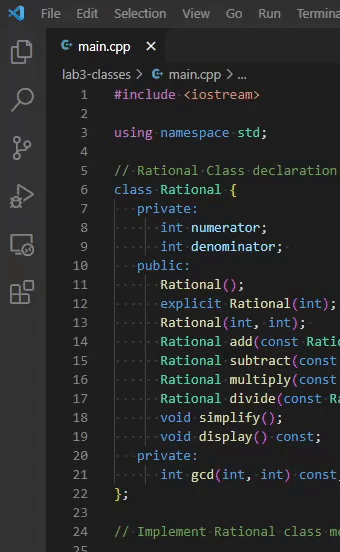

# Introduction to the Linux File System + Submitting to ZyBooks

> Authors: Victor Hill and Joshua Candelaria (special thanks to Professor Neftali Watkinson and Professor Kris Miller)

Today's module will quickly go over the basics of the Linux file system and how to use the terminal, which uses a shell called Bash, to navigate through it. In this module, you will learn:

* What the Linux file system is
* How to organize your server space using folders/directories
* Basic Bash commands

## The Linux File System

The UCR servers don't run on Windows or MacOS, but rather on Linux. In order to access and organize our files, we will have to learn how to navigate the file system.

Navigating through the Linux file system will be a bit different because we don't rely a graphical interface, we only have the terminal. However, the file system itself isn't too different from other file systems you may be familiar with. A helpful way to visualize the file system is to view it as a tree: a tree starts at the root. In this case, it would be the root directory which is denoted as `/` in Linux and usually as `C:\` in Windows. Within these root directories there are many files and directories that live within that root directory called children, and those children have children. We will go over several commands that you use to traverse the file system through the command line.

**Even though we have VSCode and other graphical interfaces, it is still important to understand how to navigate a file system with the terminal even if you have a graphical interface! Sometimes, there will be scenarios where a graphical interface just isn't available, and you have only the terimnal. One example is for knowing which files to compile and how to correctly navigate to them so you can tell the compiler where to look, so you can use `g++` with the proper parameters.**

||
|:--:|
| *A visual example of the Linux file system* |

## Navigating the Linux File System

> Note: "Folders" will be referred to as "directories" from now on, since most documentation refer to them as directories.

Log into UCR servers with VSCode's Remote-SSH and open a terminal using `Ctrl + ~` or `Cmd + ~`, and open your folder (just like module 1). Notice that the terminal, whenever it waits for your input, says the current user @ the name of the server, which in this case should look like `[(your UCR id)@xe-02 ~]`. It also says the current directory your terminal is looking at.

Whenever you log into any of the school servers, you should be placed into your user root directory/home directory. In order to see the current directory you are in, use the `pwd` command (print working directory). The path printed should be `/home/csmajs/[your CS username]`. If not, use the `cd ~` command, where `cd` is the command to "change directory" and `~` is an alias that represents your personal home directory.

Now, let's use the file system. Type the following command:

``` mkdir example_dir ```

The `mkdir` command stands for "make directory". Since your current path was your home directory, this means your new directory was created here. To make sure, run the `ls` command (stands for "list"). Let's change into that new directory with `cd example_dir`. Our path now should be `/home/csmajs/[your CS username]/example_dir`. Type `pwd` just to make sure that this is your path, since we changed to the `example_dir` directory. Now, let's go back to the home directory. Type `cd ..` The `..` is an alias that represent the previous directory/the current directory's parent. (similary, as mentioned in module 1, a single period `.` represents the current directory). These aliases (`.`, `..`, and `~`) make it much easier to move through the file system without typing the full path and names of directories.

> Note: Most commands in Bash don't echo anything to the console once you execute them to avoid clutter in the terminal. To make sure that the command worked as expected, or that you didn't make a mistake, you should ocassionally `ls` or `pwd` to make sure you're in the right place, or if a command you input worked as you expected.

Now try typing the whole path.

```cd /home/csmajs/<your_CS_username>/example_dir```

Check that we are in `example_dir` with `pwd` again, but this time we typed the whole path instead of just `cd example_dir`. This is because, in the first case, we used a *relative* path, since we were changing directories relative to our current directory. The path we used this time was an *absolute* path, since we started with the root directory `/`. Paths that start with the root directory `/` are always absolute, otherwise they are relative.

Go back to your home directory (you should know how to do this by now). The next commands we will go over are `touch` and `mv`. `touch [filename]` is simple: it creates a file with that name. `mv` stands for move, and the parameters are `mv [source file] [target directory]`. It is used to move a file from one directory to another. If the "target directory" is actually a file name and not a directory, then it will simply rename the source file to that name. So, `mv` is used to both move and rename files. Let's create a file called `example.txt`, and move it into our example directory. We can do this with the following commands:

```
touch example.txt
mv example.txt example_dir
```

We can "peek" into directories without actually changing into them. Recall the `ls` command, which just lists all the files/directory in the current directory. You can use `ls example_dir` from the home directory to list everything in the `example_dir`, but we didn't actually change directories. When you run this command, you should see that there is a file called `example.txt` in the directory.

Another command we will cover is `rm`. Now that we know how to traverse the file system, let's delete our example directory. Make sure you're home (`pwd`) and type this command:

``` rm -rf example_dir ```

`rm` stands for "remove". If we were removing a normal file, we wouldn't need these flags, but because this is a directory, we need the `-rf` flags. `-r` means to remove files recursively (this means it deletes all files and directories within that directory, so `example.txt` will also be deleted), and `-f` disables user confirmation for each deletion.

> Note: `rm -rf` is crazy powerful. You can essentially break your whole system with `rm -rf /` (don't do this, you have been warned). So, be very careful when you use this command, as there is no undoing these deletions (notice there isn't any recycle bin).

As a summary, these are ALL the commands we went over (feel free to use this as a cheatsheet until you get used to navigating file systems via the command line):

* `pwd` prints the current working directory's path.
* `mkdir` makes a directory.
* `cd` changes your directory to the directory passed in by a path.
    * `cd ..` changes your directory to the parent directory (goes to previous directory).
* `ls` lists all files in your current directory, or the target directory.
* `touch` creates a file.
* `mv [source file] [destination directory]` moves a file from one place to another, and can also be used to rename a file.
* `rm` removes a file.
    * `rm -rf` removes a directory, and all files within it.
* `g++ [target file(s)]` compiles a C++ source file, creating an executable with the name `a.out`.
    * `g++ -o [executable name] [target file(s)]` compiles a C++ source file, creating an executable with the name `[executable name]`.

Now that you know these commands, can you use them to organize your server space? It is important to organize your server space into separate directories for separate assignments. For example, you will likely have many files named `main.cpp`, so you should organize your space now before you face conflicts later. If you already did one of your labs on the server, make a directory for it, and move the files in there using the commands above.

> Note: Bash has a built in manual that shows you how to use a command and all the possible flags for it. You can use the `man` command (stands for manual), and do something like `man cd` in order to see the instructions for the `cd` command. You can also use the `--help` flag for most commands. Each command has a lot more power/capability than what we've gone over in this module, so if you want to learn more about what each command can do, you can refer to the manual.

## Downloading Files and Uploading to UCR Servers

Whenever you download files from ZyBooks, they will download as zipped files. To upload them to the UCR servers to work on them, you will have to unzip/extract the files. Depending on your operating system and your own personal configuration, there are different methods to unzipping files. 

<details>
<summary><b>Windows</b></summary>

When you download from ZyBooks, the `.zip` file should be in your Downloads folder.

1. Find the folder in your Downloads folder **OR** drag it onto your desktop.
2. Right click the file, and click "Extract all". Click "Extract"
3. The files should be in a folder in the same folder you extracted the zip file in.

<p align= "center">
    
</p>

</details>

<details>
<summary><b>MacOS/Linux</b></summary>

When you download from ZyBooks, the `.zip` file should be in your Downloads directory. Open your terminal and run the following commands:

```
cd Downloads
unzip [name of lab]
```

The unzipped file(s) will be in the Downloads folder.

> Note: If you do not want to unzip directly into your Downloads directory, then you can use the destination flag `-d`. This means the command you would run would be `unzip [name of lab] -d [destination directory]`

</details>

Once you extract the files, drag and drop them into a Remote-SSH instance of VSCode, and they will upload automatically.

<p align="center">
    
</p>

> Note: If for some reason none of these methods work for you, then you can just `touch` a new file and copy paste the contents from the zipped file into the server. However, it is still important to understand how to upload to a remote server, as sometimes you may have to upload a multitude of files.

## Submitting to ZyBooks

Once you're done working on your file and you're ready to submit your file, you have to download the file from the remote server to your local machine. The Remote-SSH plugin allows you to do this quickly.

1. Open the the VSCode File Explorer (first button on the left taskbar), and find the file you were working on.
2. Right-click the file, and click "Download".
3. Save the file where you want to save it on your local machine
4. Upload the file to ZyBooks for submission, and wait for the autograder to finish.

<p align="center">
      
</p>
