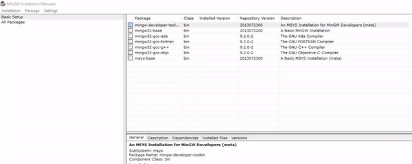
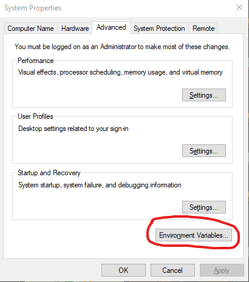
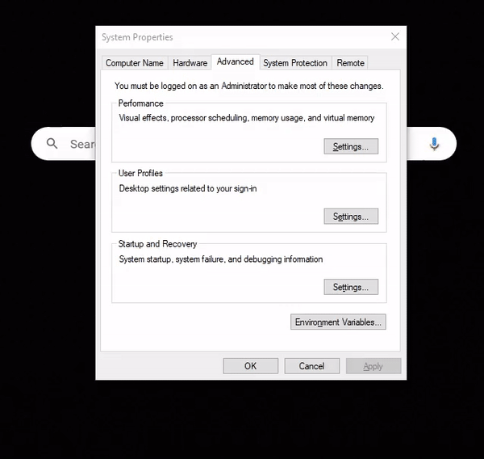
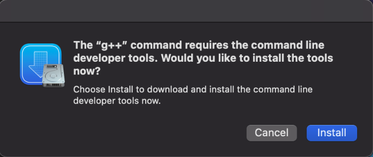

# Configuration of Your Own Development Environment

> Authors: Victor Hill and Joshua Candelaria (special thanks to Professor Neftali Watkinson and Professor Kris Miller)

You have been working on UCR servers to develop your programs. Now, today you will learn:

* How to setup VSCode as a development environment on your own machine
* How to configure g++ to work on your computer

## Installation and Configuration of g++

For the past few labs, you have been developing on the UCR servers. However, if you want to set up your own development environment on your local machine, then follow the instructions here. If not, feel free to skip this module.

First, check the extensions tab to make sure that you have the C++ extension installed in VSCode.

Now, in order to configure VSCode to work with C++, we must install a C++ compiler. The compiler we will be using is g++, which is the C++ compiler from the GNU Compiler Collection (GCC). The way we install our compiler varies on which operating system we are using, so drop down the appropriate list and follow the instructions there.

<details>
<summary>Windows 11/Windows 10</summary>
On Windows, we will be installing MinGW so that we can compile our C++ programs using the <code>g++</code> command. <br>
1. Download the MinGW Installation Manager Setup Tool at <a href="https://sourceforge.net/projects/mingw/">this link</a>. <br>
2. Run the setup executable. <strong>Copy your installation directory path, you will need this later!</strong> By default, it should be <code>C:\MinGW</code>, but if it is something else or you want to change it somewhere else, copy that instead. This is very important, as we need to <strong>paste the path to the MinGW folder somewhere else later</strong>. <br>
3. Open the MinGW Installation Manager after it is done setting up. You should see multiple packages, but we only need 4 of them: <br>
<pre>
mingw-developer-toolkit
mingw32-base
mingw32-gcc-g++
msys-base
</pre>
Right-click each package, and click "Mark for installation". Then, in the top left corner, click Installation > Apply Changes.
<p align="center">
    
</p>
4. Go to the Start Menu and search for "Edit the system environment variables". You should see a menu that looks like this.
<p align="center">
    
</p>
Now, under the system variables tab, look for the variable "Path". Click on it, then click "Edit". Click "New", then paste in the MinGW folder path you copied in step 2 (if you forgot to do this, then look for where you installed the folder and copy the path). At the end of the path, add <code>\bin</code> so that your path looks like this:
<pre>
C:\MinGW\bin
</pre>
If you installed MinGW in some other directory/folder, then it will look something like this:
<pre>
[path where you installed MinGW]\MinGW\bin
</pre>
<p align="center">
    
</p>
5. The compiler should be fully installed by now. To make sure, go back to VSCode. At the top, click "Terminal > New Terminal". This opens a new terminal at the bottom of your screen. Run the following command in the terminal:
<pre>
g++ --version
</pre>
If everything works, then your output should look something like this, confirming that g++ is working properly:
<pre>
g++.exe (MinGW.org GCC Build-2) 9.2.0
Copyright (C) 2019 Free Software Foundation, Inc.
This is free software; see the source for copying conditions.  
There is NO warranty; not even for MERCHANTABILITY or FITNESS FOR A PARTICULAR PURPOSE.
</pre>
Now, you have g++ installed and configured! You might be wondering why we had to do all this. We can think of the "Path" variable in Windows as assigning executables a name, just like a variable in C++, or a desktop shortcut for an executable. The reason we do this is because whenever we want to compile our programs, we can just use the <code>g++</code> command in our terminal, rather than going to the directory, passing in the file, and running the executable manually every time we want to compile. Since we usually compile code multiple times every time we want to work on a file, this will save you lots of time in the long run.
</details>

<details>
<summary>Linux (Debian-based)</summary>
1. Run the following commands on your terminal (open with Ctrl+Shift+T), which will install the g++ compiler for C++ and add it to your path variables automatically:
<pre>
sudo apt update
sudo apt install build-essential
</pre>
2. Verify that g++ is installed properly by running this command:
<pre>
g++ --version
</pre>
The output should look something like this if g++ was installed properly:
<pre>
g++ (Ubuntu 9.4.0-1ubuntu1~20.04.1) 9.4.0
Copyright (C) 2019 Free Software Foundation, Inc.
This is free software; see the source for copying conditions.
There is NO warranty; not even for MERCHANTABILITY or FITNESS FOR A PARTICULAR PURPOSE.
</pre>
</details>

<details>
<summary>MacOS</summary>
    
1. Open a terminal (Cmd+Space, then search for Terminal). Type the following command:
```
g++
```
    
2. You will be prompted to install command line tools for XCode. Click install.
<p align="center">
    
</p>
3. Verify that g++ is installed properly by running this command:
```
g++ --version
```

</details>

### Using the Compiler on the Command Line

Now that our compiler is installed, let's use it! The process should be familiar. Create a new folder on your desktop, and name it CS010B. Open it in VSCode by going to File > Open Folder (or by using the shortcut Ctrl + O or Cmd + O for MacOS), and open the CS010B folder. Now, we have an empty folder open in VSCode. Now open a terminal in VSCode by going to Terminal > New Terminal (or by using the shortcut Ctrl + \` or Cmd + \` for MacOS). Your terminal should show the path to the CS010B folder. To make sure, use the ```pwd``` command, and it should print the path to the CS010B folder. ```pwd``` stands for "print working directory", and it is a helpful command for keeping track of where your terminal is currently looking at. We can use our terminal to create a file in our folder by using the ```touch``` command. Let's create a file called ```main.cpp``` by running the command ```touch main.cpp```. Now, you should see an empty C++ file in your CS010B directory. Open it, and paste this code in.

```cpp
#include <iostream>
using namespace std;

int main() {
   cout << "Hello World!" << endl;
   return 0;
}
```

Make sure to save your file, and in the terminal, type the following command:

``` g++ main.cpp ```

If the compilation worked, you will see no output and a new file in your CS010B folder. If you are using Windows, it should be ```a.exe```, but if you're using Linux/MacOS, it should be ```a.out```. In order to see all the files in the current directory in your terminal, you can print them using the ```ls``` (stands for "list") command. To run out new executable, run the command ```./a.exe``` (if you are on Windows) or ```./a.out``` (if you are on Linux/MacOS). Once you execute the command, you should see "Hello World!" printed out into the terminal.

> Note: The ```.``` is an alias that refers to the current directory. If you want to learn why we need to use ```./``` to run executables, then [this StackOverflow post](https://stackoverflow.com/questions/6331075/why-do-you-need-dot-slash-before-executable-or-script-name-to-run-it-in-bas) provides a good explanation.

On larger projects and programs in object-oriented languages, it is good practice to break up work into multiple files in two groups: header files that contain your declarations (in C++, these files have a file extension of `.hpp`/`.h`), and source files that contain your definitions (in C++, these files have a file extension of `.cpp`/`.cc`/`.cxx`). The g++ compiler will allow us to compile all of these files into a single executable, as if they were a single file. In a later lab, you will learn more about how this process works.

Now, you have a working development environment for C++ on your local machine!
