# Introduction to Visual Studio Code and C++

> Authors: Victor Hill and Joshua Candelaria (special thanks to Professor Neftali Watkinson and Professor Kris Miller)

Welcome to CS010B! In this lab, we will be configuring and introducing the basics of Visual Studio Code, an IDE with many useful features from syntax highlighting to intelligent code completion. In this introductory module, you will learn:

* How to install and configure VSCode for C++ programming
* How to compile with g++, a C++ compiler
* Basic use of VSCode with SSH

**IMPORTANT**: Before we proceed, make sure that you have a CS account. If you **don't have one/aren't sure if you have one**, [go to this link](https://sites.google.com/a/ucr.edu/cse-instructional-support/home/accounts#h.r2x4rti8gpg9) to set one up. The same site will help if you **forgot your password and need to reset it**.

## What is an IDE?

An IDE, or an integrated development environment, is a piece of software that provides us with a multitude of different components in one user interface to maximize productivity. The most common features in an IDE are a code/text editor (usually with syntax highlighting), build automation (a compiler, version control like Git, or automated testing), and a debugger. While IDEs are not required (you have written and compiled code without one before), they provide the tools to create bigger projects, collaborate with others, and make development more convenient.

## Why VSCode?

VSCode is an incredibly popular IDE ([the most popular in the world, actually!](https://insights.stackoverflow.com/survey/2021)), and for good reason. We chose it for this class because it is very lightweight and widely supports most langauges and features that are considered essential for development. It also has a large marketplace of extensions that make it easy to extend and personalize your version of VSCode. This doesn't mean that VSCode is the **best** IDE out there; we encourage you to get experience with other IDEs if you wish/if you are ever required to use a different one. Here are some general questions that you should ask yourself for finding an IDE that suits your needs:

* Does the IDE support the programming languages I am going to use? (Bonus: is it recommended by the development community as a good option for those languages)
* Is it mature and well supported?
* Does it support collaboration and a direct connection to a respository?
* Does it support other technology I will use for my project? (connecting to servers, alternative testing frameworks, etc.)
* Does it have code autocomplete?
* Does it work with my operating system?
* Do I have to pay a license for it?
* Can I customize it however I want?

## Part 1: Installation and Configuration

First, install the correct version of VSCode at [this link](https://code.visualstudio.com/download) for your operating system and processor. Once VSCode is installed, we need to install an extension called Remote-SSH. This extension will allow you to work on UCR's servers remotely, saving your progress across devices and allowing you to use the software already installed on the server (like the compiler). To do this, open VSCode go to the extension tab on the left bar, and search for Remote-SSH. Make sure it is the extension that is published by Microsoft, verified with the blue check.

<p align="center">
    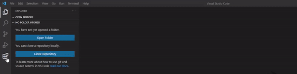
</p>

Now, we can SSH into UCR servers! To set up a connection to CS010B servers, follow these steps:

1. Open the command palette (press F1), and type "Remote-SSH". Select the "Remote-SSH: Connect to Host" option.
2. Click add a new host, and type the following command. Note that your CS username is the same as your UCR NetID.

    ``` ssh [your_ucr_netid]@cs010b.cs.ucr.edu ```

> Note: If you are prompted to select the SSH configuration to edit, select the one that starts with `C:\Users` if you are on Windows, or if you are on Linux/MacOS, select the one that starts with `/home/`
   
3. Now you have saved the address as a known host. Repeat step 1 by typing in "Remote-SSH: Connect to Host" into the command palette (F1), and you should see `cs010b.cs.ucr.edu` is a saved host. Click on it, and a new instance of VSCode should open, prompting you for your CS password.

> Note: If you are prompted to select the platform of the remote host `cs010b.cs.ucr.edu`, select Linux, regardless of your operating system.

4. Log in with your CS password. Now that you're connected, go to the extensions marketplace and install the C++ extension. It should look like this:

<p align="center">
    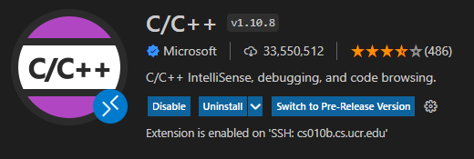
</p>

Now, you have a fully configured workspace on VSCode while connected to school servers!

In order to close the connection, click the bottom left corner (it should say `SSH: cs010b.cs.ucr.edu`). It should pull up the command palette, and to exit, press "Close remote connection". **PLEASE DON'T FORGET TO DO THIS WHENEVER YOU ARE DONE!** Closing out of VSCode without manually closing the connection doesn't log you out on the server, which consumes precious server resources.

## Part 2: Working on a Remote Server

Open a folder using Ctrl+O / Cmd+O, or by pressing the first icon on the tab on the left (called the explorer). When opening a folder for the first time, you will be asked if you trust the authors. Click "yes". This should default to your home directory/folder, which should have the path `/home/csmajs/[your_ucr_netid]` for students in CS related majors or `/class/classes/[your_ucr_netid]` for students who are taking CS 010B as a service course for their major.  (you may be asked for your password again). This will be the directory that all your files will be in; think of it as your reserved space on the UCR server.

In order to demonstrate how to use VSCode with C++ so you can do your labs, we will write and compile a simple program. Create a new directory/folder called `example` by pressing the new folder button, and create a new file called `main.cpp` in the `example` directory.

<p align="center">
    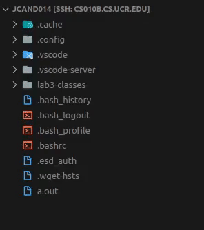
</p>

In `main.cpp`, copy and paste the following code:

```cpp
#include <iostream>
#include <string>
using namespace std;

int main()
{
    string input;
    cout << "What's your name?" << endl;
    getline(cin, input);
    cout << "Hello " << input << '!' << endl;
}
```

Now that you have your source code, lets compile it! Open up a terminal by using the shortcut `Ctrl + ~`. Now, type in and run the following command:

``` g++ example/main.cpp ```

Let's break down what this command is: `g++` is the compiler that we use for C++ source code. `example/main.cpp` is simply the path of the target source code file we want to compile.

> Note: The shell that we are using is called Bash. A useful feature of a lot of shells is that they support autocomplete. For example, you can type ```g++ example/m``` and press the Tab key, and it will autocomplete the name to ```example/main.cpp```. This will be useful for when you have longer file names.

Now, if your program has no errors and compiles, there should be no input in your console, and just be awaiting your next input. If your program wasn't able to compile, you would see all your error messages here. You should see that there's a new file in your directory called `a.out`. This is your executable! In order to run it, type and run this following command.

``` ./a.out ```

The `./` followed by the name of the exectuable is the way we run our compiled programs.

The terminal should now be running your executable, and waiting for your input.

By default, source files compiled by g++ are named ```a```, but usually we want to give our programs recognizable names. To do this, we can use the compiler flag ```-o```, which is a compiler flag that names the output executable. First, delete the `a.out` file. Then, run the following command:

``` g++ -o hello_world main.cpp ```

This will compile ```main.cpp``` into an executable called ```hello_world```, and you can run it by running the command ```./hello_world``` in your console.

## Optional (but recommended!): Key-Based Automatic Login

Notice that when you want to open a folder, you are prompted to enter your password again. This essentially makes it so you have to input your password twice to log in, which gets very tedious. In this section, you can set up Remote-SSH to remember your password so you only have to input it once.

Instructions vary based on operating system:

<details>
<summary><b>Windows</b></summary>

In order to set up key based login with SSH, we will first have to install an SSH client.

1. Go to the Start Menu and search for "Add an Optional Feature"
2. Click "Add a feature"
3. Search for OpenSSH Server and install

<p align="center">
    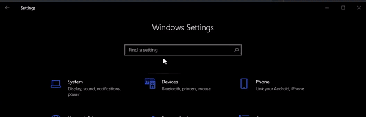
</p>

Now, we will generate something called a public/private key pair, which we will use to log into Remote-SSH.

4. Open a Command Prompt by pressing (Windows Key + R) which opens the "Run" application, and then type in `cmd` which opens the command prompt.
5. Run the following command:

``` ssh-keygen -t rsa -b 4096 ```

The output should be the following:
```
Generating public/private rsa key pair.
Enter file in which to save the key [your path here]:
```

The name of the file can be whatever you want it to be. For the purposes of the tutorial, the name we will be using is ```mysshkey```. If you use something else, substitute the name wherever we use ```mysshkey```.

Now, you will be prompted with this:

```
Enter passphrase (empty for no passphrase):
```

**Do not enter a passphrase**. This will require you to enter your passphrase every time you want to log in, which defeats the purpose of automatically logging in with your public/private key pair. Press Enter twice to proceed without entering a passphrase. Note that there is a tradeoff between security and convenience with this method, as anyone with access with your device will be able to log into UCR servers.

<p align="center">
    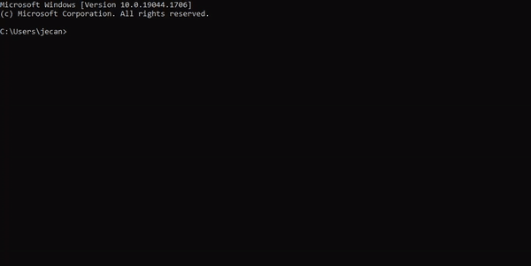
</p>

Now, we need to navigate to our generated keys. Go to your user folder, which should be in the path `C:\Users\[your windows username]`. You should see two files named `mysshkey` (or whatever you named your keys). The one without a file extension is your *private* key, **which you should never, ever share with ANYONE**. The one with a file extension of `.pub` is your *public key*.

We need to save our public key on the server.

6. Open the public key file `mysshkey.pub` with Notepad. Copy the contents.
7. SSH into UCR servers using the method outlined in "Part 1: Installation and Configuration" above.
8. Make a new folder called `.ssh`, and in there create a file called `authorized_keys`. Paste in the public key, and save the file. For this to work, these must be the exact names of the folder and the file.

<p align="center">
    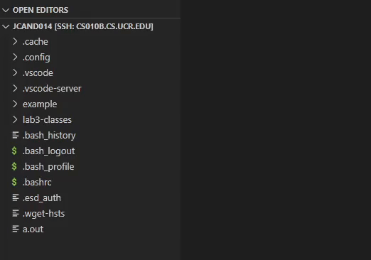
</p>

Now, we need to configure our Remote-SSH extension to use the private key. This will allow us to automatically log in.

9. Go back to the folder with the keys (reminder: it should be `C:\Users\[your windows username]`). Select your private key file, which is `mysshkey` (no file extension). Copy the path using the `Copy Path` button at the top of the file explorer.
10. Open a *local* instance of VSCode. Pull up the command palette (F1) and type in: "Remote-SSH: Open SSH Configuration File".

Pick the one that starts with `C:\Users\[your windows username]`. You should see something like:

```
Host cs010b.cs.ucr.edu
    HostName cs010b.cs.ucr.edu
    User [your_ucr_netid]
```

11. Add the following line, so that your file looks like this:

```
Host cs010b.cs.ucr.edu
    HostName cs010b.cs.ucr.edu
    User [your_ucr_netid]
    IdentityFile "YOUR PRIVATE KEY PATH"
```

...where you paste your private key path. **Make sure you remove the quotes!** Save the file. If everything worked properly, then you will no longer be prompted for your password when you SSH using the device you set this up on.

<p align="center">
    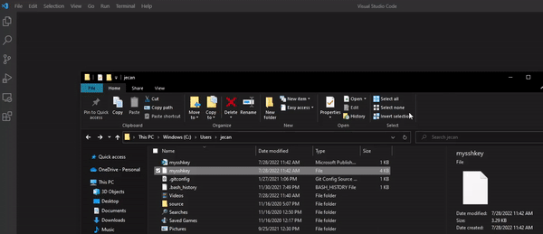
</p>

</details>

<details>
<summary><b>MacOS</b></summary>

</details>

<details>
<summary><b>Linux (Ubuntu)</b></summary>
We will generate something called a public/private key pair, which we will use to log into Remote-SSH.

1. Run the following commands in your command prompt (from your user home directory):
```
cd .ssh
ssh-keygen -t rsa -b 4096
```

The output should be the following:
```
Generating public/private rsa key pair.
Enter file in which to save the key [your path here]:
```
The name of the file can be whatever you want it to be. For the purposes of the tutorial, the name we will be using is ```mysshkey```. If you use something else, substitute the name wherever we use ```mysshkey```.

Now, you will be prompted with this:

```
Enter passphrase (empty for no passphrase):
```

**Do not enter a passphrase**. This will require you to enter your passphrase every time you want to log in, which defeats the purpose of automatically logging in with your public/private key pair. Press Enter twice to proceed without entering a passphrase. Note that there is a tradeoff between security and convenience with this method, as anyone with access with your device will be able to log into UCR servers.

You should see two files in the `.ssh` directory named `mysshkey` (or whatever you named your keys). The one without a file extension is your *private* key, **which you should never, ever share with ANYONE**. The one with a file extension of `.pub` is your *public key*.

2. Run the following command:

```
cat mysshkey.pub
```
Copy the (very long) output using Ctrl+Shift+C. This is your public key.

3. SSH into UCR servers using the method outlined in "Part 1: Installation and Configuration" above.
4. Make a new folder called `.ssh`, and in there create a file called `authorized_keys`. Paste in the public key, and save the file. For this to work, these must be the exact names of the folder and the file.

<p align="center">
    
</p>

5. Open another terminal (start from user home directory), and run the following commands:

```
cd .ssh
echo -e '\tIdentityFile /home/~/.ssh/mysshkey' >> config
```

What the second command does is append a command to the end of your SSH config file that reads the private key, which authenticates you without the need for entering your password.

</details>


## Optional: Useful Features of VSCode

VSCode has many useful features that help increase your productivity. You will learn more about some of these features later (debugging, how to use your terminal, and other features when editing multiple files at once), but some of the editing features that will be useful to you right now are:

| 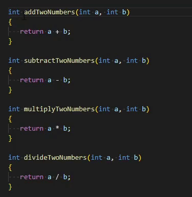 | 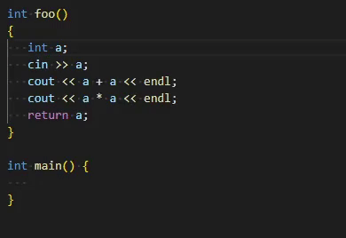 | 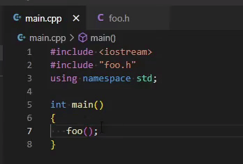
| :--: | :--: | :--: |
| *Alt + Left Click to add a cursor*| *Rename variables/functions easily and quickly*| *Go to definition/declaration of a variable/function* 

| 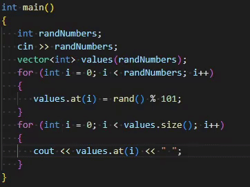| 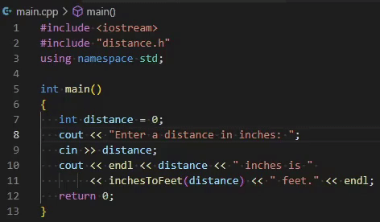|
| :--: | :--: |
| *Highlight line by line with Ctrl + L or Cmd + L, then comment with Ctrl+/ or Cmd+/* | *Move a line of code with Alt + Arrow Keys* |

Another useful setting is in File > Auto Save, to prevent yourself from potentially losing progress.

To find even more useful commands, press F1 to bring up the Command Palette that allows you to search for whatever command you need. [Here](https://code.visualstudio.com/docs/getstarted/keybindings) is a list of keybindings if you wish to get familiar with the many shortcuts in VSCode.

We encourage you to become more familiar and comfortable with your new development environment. Make it your own! Install a theme, use some fun extensions, and play around in C++. You can create your own keybinds and themes, and add your own extensions from the marketplace. Later in this course, we will go over some more useful features that you will be able to use in future courses and beyond.
